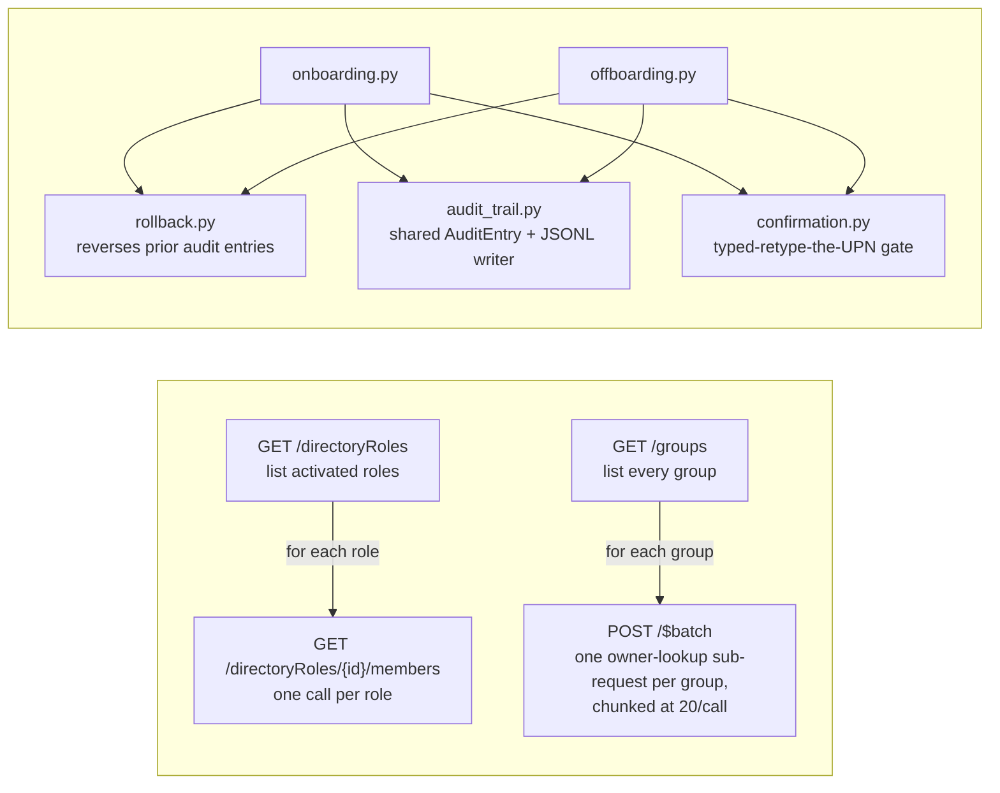

# Identity Automation and Posture Audit

Identity teams usually find out about MFA gaps, dormant licensed accounts,
and orphaned admin access during an audit or an incident — not before.
This project closes that gap on two fronts. The first is a nightly,
unattended check against a real Microsoft Graph tenant that surfaces
seven categories of drift — missing MFA, stale-but-licensed accounts,
long-lived guests, privileged role holders, expiring service-principal
credentials, ownerless groups, non-compliant devices — into one
severity-ranked report, emailed automatically and run on a schedule
rather than waited on until something breaks.

The second is the lifecycle work that otherwise happens by hand: creating
a user with their department's groups and license, and later disabling
them, revoking their sessions, removing them from those groups, and
reclaiming the license. Every action is logged to an audit trail,
reversible where the Graph API allows it and documented where it isn't,
and none of it runs for real without an explicit flag and a typed
confirmation.

## Status

All seven of Part A's checks are now implemented, covered by tests that
mock Graph pagination and 429 throttling, and live-verified against a real
tenant:

- Users without MFA registered.
- Licensed users inactive 90+ days. The live run found 0 stale users in the
  sandbox tenant — expected, since its test users are fictitious and freshly
  created rather than long-idle, not evidence the logic never matches.
- Guest accounts and how long they've been in the tenant. The live run
  found 0 guests — expected for a fresh sandbox with no external invites
  sent, not evidence the logic doesn't work.
- Users holding privileged directory roles. The live run found the expected
  sandbox tenant admin as the sole privileged-role holder.
- Service principals with credentials nearing expiry. The live run also
  incidentally proved pagination against a real multi-page response — 168
  service principals across 2 pages — and found 0 credentials nearing
  expiry, expected for a fresh sandbox populated mostly with
  Microsoft-provisioned service principals rather than long-lived
  custom app registrations.
- Groups with no owner. The live run confirmed the N+1 call pattern flagged
  during development — 1 groups-list call plus 8 per-group owner checks —
  and found 0 ownerless groups among the sandbox's 8 groups, all of which
  have at least one owner. Expected for a small, actively-managed sandbox,
  not evidence the logic doesn't work.
- Devices that are non-compliant or haven't checked in. The live run found
  0 devices in the tenant — expected, since the sandbox has no
  enrolled/registered devices, not evidence the logic doesn't work.

**Part A's checks are now complete, and severity-ranked HTML report
generation is implemented, tested, and live-verified.** A live run against
the sandbox tenant correctly produced 16 critical findings (every MFA-less
user) and 1 warning finding (the sole privileged-role holder — not
escalated to critical, since that account does have MFA registered), and
the report rendered correctly in a browser. See "Report severity model"
below for the ranking logic.

Email delivery is also implemented, tested, and live-verified
end-to-end — the report email was sent via Graph's `sendMail` and
confirmed received in the sandbox mailbox, not just accepted with a 202
by the API. It's optional: unset `DIGEST_TO`/`DIGEST_FROM` and a run
produces the local file only.

Nightly scheduling via GitHub Actions is now implemented and
live-verified — a manually triggered run of the workflow succeeded
end-to-end: all seven checks returned 200, the report was written, and
the email sent with a 202, confirmed received in the sandbox mailbox from
the automated run itself, not just from a local one. The CI-log
suppression was confirmed live too: the Actions run log showed only the
per-check summary-count lines, no per-user detail. GitHub's own secret
scrubbing added a second layer on top of that automatically, redacting
the `DIGEST_FROM` address in the log wherever it appeared, on top of
(not instead of) the suppression logic already built for this.

**All three pieces of the "audit runs nightly, unattended, emailing a
severity-ranked report" acceptance criterion are now complete and
live-verified**: report generation, email delivery, and nightly
scheduling.

The "read-only until the audit is solid" gate from the project brief is now
met, held to precisely rather than overstated: the audit issues no
identity- or directory-mutating writes — no user, group, role, or device is
ever created, changed, or deleted. `Mail.Send`'s `sendMail` call is a real
`POST`, so "every check issues GET requests only" is no longer literally
true, but that POST is a notification side-effect of the report, not a
state-changing write against the Graph data model the checks read from. All
seven of the checks the brief asks for exist, are tested, and have been run
against a real tenant.

Both pieces of Part B are now built and dry-run tested. Onboarding (create
user, add to department groups, assign license) has had a real `--execute`
run succeed end-to-end against the tenant, including the group-add step
against a real group ID (`40780cb0-ba71-486c-ae85-83c48c739cf9`, present
in `config/department_groups.json`) — `create_user`, `add_to_group`, and
`assign_license` all recorded `"result": "success"` in the same
`--execute` run (see `logs/onboarding-audit.jsonl`, entries 1-3). See the
Permissions table for further detail. Offboarding (disable sign-in, revoke refresh tokens, remove from
groups, reclaim the license, convert mailbox to shared) has now had a
full real `--execute` run succeed end-to-end against the tenant — disable,
revoke, both group removals, and the correctly-not-automated mailbox step
all completed as designed — with one known transient issue on the
license-reclaim step (a 409 that a manual retry resolved, root cause not
confirmed). See "Offboarding reversibility" below and
`src/identity_audit/offboarding.py`'s docstring for the full account of
that issue.

Rollback for both onboarding and offboarding is now built and
live-verified — see "Rollback" below for the feature itself, a real bug
found and fixed while testing it (rollback initially could target its own
prior output instead of the original run), and the live `--execute`
rollback result.

## What this will do

**Part A — audit (read-only, built first):**

- Users without MFA registered
- Accounts that haven't signed in for 90+ days but still hold licenses
- Guest accounts and how long they've been there
- Users holding privileged directory roles
- Service principals with credentials nearing expiry
- Groups with no owner
- Devices that are non-compliant or haven't checked in

Output: an HTML report, severity-ranked, emailed on a schedule.

**Part B — writes (dry-run by default, built after Part A is solid):**

Onboarding: create user, assign groups from a department mapping, assign a
license, log every action.

Offboarding: disable sign-in, revoke refresh tokens, remove from groups,
reclaim the license, convert the mailbox to shared. Reversible where the
Graph API allows it, documented where it isn't.

Every write path defaults to `--dry-run`; a real run needs an explicit flag
and a typed confirmation.

## Offboarding reversibility

Per-action, not a general statement — the project brief asks for this to
be documented precisely:

| Action | Reversible via Graph? | How / why not |
| --- | --- | --- |
| Disable sign-in | Yes | `PATCH /users/{id}` with `accountEnabled: true` restores the exact prior state. |
| Revoke refresh tokens | Not as an action | No Graph call un-revokes a specific session — those tokens are invalidated permanently. Not a lasting lockout, though: a still-enabled account lets the user sign in again immediately and get a fresh valid session. |
| Remove from groups | Yes | `POST /groups/{id}/members/$ref` (the same call onboarding uses to add) re-adds the user to each group ID the audit trail recorded before removal. |
| Reclaim the license | Yes, with a caveat | `assignLicense`'s `addLicenses` re-assigns the same SKU — but if the tenant's SKU pool has no free seats left by the time someone reverses it, that fails for licensing-inventory reasons, not a Graph limitation. |
| Convert mailbox to shared | Not automated at all | There's no Microsoft Graph endpoint for mailbox type conversion — it's an Exchange Online administrative operation, requiring Exchange's own `Exchange.ManageAsApp` application permission on a separate auth surface this project has never used. Not faked or silently skipped: every offboarding run logs this action with `result="not_automated"`. |

**Live-verified end-to-end.** A full real `--execute` offboarding run
succeeded against the tenant: disable, revoke, both group removals, and
the mailbox step (correctly `not_automated`) all completed as designed.
One known transient issue: the license-reclaim step hit a 409 immediately
after disable+revoke; a manual retry of the identical call succeeded with
no code changes. The original 409's error body was never captured, so
this is **known but not root-caused** — consistent with directory
propagation delay after the two preceding writes, not confirmed as the
actual cause. No retry loop has been added for this step. Full account in
`src/identity_audit/offboarding.py`'s docstring.

## Rollback

`--rollback` on both `onboard-user` and `offboard-user` reverses a prior
run instead of starting a new one — it *executes* the reversibility table
above rather than just documenting it. Same conventions as everything
else in this project:

- **Dry-run by default, `--execute` for real**, same typed-confirmation
  gate (retype the exact UPN) as onboarding's and offboarding's forward
  flows.
- **Which run**: `--timestamp` picks an exact one — every entry from a
  single onboarding/offboarding run already shares one timestamp value,
  so no new run-identifier scheme was needed. Omitted, it defaults to the
  most recent run recorded for `--user-principal-name`.
- **LIFO reversal order**: undoes the last action first (license, then
  groups, then account state) — the more generally defensible default
  for any rollback, though none of these particular actions actually
  depend on each other's order at the Graph API level.
- **Non-reversible actions are reported as such, not silently skipped**:
  `revoke_refresh_tokens` and `convert_mailbox_to_shared` show up in
  rollback output as "not reversible" — they're simply absent from the
  reversal mapping, so the shared engine reports them on its own with no
  special-casing needed.
- Shared between both CLIs via `src/identity_audit/rollback.py` - one
  engine; each module supplies only its own action → reversal mapping
  (and, for onboarding, the decision that reversing `create_user` means
  disabling the account rather than deleting it — documented in
  `onboarding.py`, not decided silently).

### Bug found and fixed: rollback targeting its own prior output

Full write-up: [`docs/rollback-bug-writeup.md`](docs/rollback-bug-writeup.md).

Found via live testing, not by inspection. A dry-run rollback was run
first — which correctly writes its own `rollback_*` audit entries, same
as every dry-run action in this project. A real `--execute` rollback was
then run against the same user right after. It found the *dry-run
rollback's own entries* as "the most recent run" instead of the original
onboarding run, and tried to reverse those — producing double-prefixed
action names like `rollback_rollback_create_user`, every one reported
"not reversible" since nothing matches that name in any reversal mapping.
Zero real Graph calls happened, but nothing was rolled back either — a
silent no-op dressed up as output, which is exactly what made it easy to
miss until it was actually run twice in a row.

**Root cause**: `find_run_entries()`'s "most recent run for this user"
lookup never excluded `rollback_`-prefixed entries from consideration, so
a prior rollback attempt's own log entries were eligible to be selected
as the *next* rollback's target.

**Fix**: entries whose `action` starts with `rollback_` are now excluded
entirely at read time, before they're ever grouped into a candidate run —
this blocks both the default "most recent" path and an explicit
`--timestamp` that happens to land on a rollback run, since targeting a
rollback with another rollback isn't a meaningful operation this engine
supports at all, not just a case to deprioritize.

**Test**: `test_rollback_never_targets_a_prior_rollbacks_own_entries` in
`tests/test_rollback.py` reproduces the exact scenario using the real
`run_rollback()` function, not a hand-built fixture — writes original
entries, runs a real dry-run rollback against them (confirming via the
log that it genuinely did write `rollback_*` entries), then proves a
subsequent lookup still resolves to the original run and correctly
reverses it end-to-end.

### Live-verified

A real `--execute` rollback against the tenant correctly reversed license
assignment and user creation (both reported `reversed`). Group removal
reported `failed` — **not a bug**: the membership had already been
removed by an earlier offboarding run against the same user, so there was
nothing left to remove. Confirmed directly rather than assumed:
`scripts/check_group_membership.py` queried the group's membership list
directly and confirmed the user genuinely wasn't a member at the time of
the rollback attempt. The audit trail's `failed` result here is the
system behaving honestly under already-consistent state, not a defect —
trying to remove someone from a group they're not in is expected to fail,
and reporting that plainly, rather than masking it as success, is
correct.

## Report severity model

Findings are ranked into three levels:

- **Critical** — an active exposure right now (no MFA registered) or
  something that already failed rather than being about to (a service
  principal credential that's expired, not just expiring).
- **Warning** — a governance or hygiene gap that raises risk without being
  an active compromise: stale-but-licensed accounts, ownerless groups,
  non-compliant devices, credentials nearing expiry, or simply holding a
  privileged role on its own.
- **Info** — visibility, not a failure: guest accounts (existing is normal
  for most orgs; this is about awareness of how long they've been around),
  and devices that are compliant but just haven't checked in recently.

**Escalation.** A privileged-role finding is bumped to critical if that
same user also shows up in one of these other checks:

- No MFA registered — an admin account reachable without a second factor.
- Guest account — an external identity holding elevated internal access.
- Inactive 90+ days, still licensed — a dormant admin credential nobody's
  watching but that still works.

The full reasoning, and the code that implements it, lives in
`src/identity_audit/report.py`.

## Design constraints

- **Certificate-based app-only auth** — no client secret in code or config.
- **Pagination** — follows `@odata.nextLink`, tested against a forced small
  page size.
- **Throttling** — honors `Retry-After` on HTTP 429, no fixed sleep.
- **Least privilege** — starts at `User.Read.All`; every additional
  permission gets a one-line justification here once it's requested.
- **Batching** — implemented for the ownerless-groups check specifically,
  via `GraphClient.batch()`. Not applied elsewhere: no other Part A check
  has the same per-item N+1 fan-out at scale — the privileged-role check
  has a structurally similar two-step shape (list roles, then members per
  role), but the outer list there is a handful of *activated* directory
  roles, not every group in the tenant, so the benefit would be much
  smaller and it wasn't touched. See Measurements below for the actual
  numbers.
- **Audit log** — every write records who ran it, what changed, and the
  before/after state.

## Permissions

**Rollback needs no new grant.** Checked, not assumed: every Graph call
`src/identity_audit/rollback.py`'s reversers make (`GET /users/{id}`,
`PATCH accountEnabled`, `POST`/`DELETE` on group membership,
`POST assignLicense`) is the same call onboarding or offboarding already
makes forward, just invoked in reverse — no permission exists solely for
rollback. The rows below note where a live rollback run added further
confirmation.

| Scope | Type | Justification |
| --- | --- | --- |
| `User.Read.All` | Application | Baseline directory read the app authenticates with — resolves the user identities (UPN, display name, account state) that every check's findings are reported against; app-only because this runs as an unattended nightly job with no signed-in user to delegate from. Also part of the confirmed-sufficient pair (with `AuditLog.Read.All`) for reading `signInActivity` in the stale-account check. Also covers rollback's UPN-to-object-ID resolution (`GET /users/{id}`) — live-confirmed by a real `--execute` rollback run, no new grant needed. |
| `Reports.Read.All` | Application | Needed by the MFA-registration check to call `reports/authenticationMethods/userRegistrationDetails`. Microsoft's docs list this as sufficient on its own, but live testing against this tenant showed it is **not** — see `AuditLog.Read.All` below. |
| `AuditLog.Read.All` | Application | Required alongside `Reports.Read.All` for `userRegistrationDetails` on this tenant: a live app-only call with `Reports.Read.All` granted and consented still 403'd with `Authentication_MSGraphPermissionMissing`, naming `AuditLog.Read.All` as missing. Broader than the docs suggest should be necessary, but confirmed required by testing, not assumption. Also covers the stale-account check's `signInActivity` reads on `/users` — live-tested against the tenant, no additional permission was needed there. |
| `RoleManagement.Read.Directory` | Application | Needed by the privileged-role check to call `/directoryRoles` and `/directoryRoles/{id}/members` — role membership is a distinct permission surface that none of the other granted scopes cover. Confirmed sufficient by live testing against the tenant, not assumed from docs. |
| `Application.Read.All` | Application | Needed by the service-principal-credential check to read `passwordCredentials`/`keyCredentials` on `/servicePrincipals` — service principal objects aren't covered by any of the other granted scopes. Confirmed sufficient by live testing against the tenant. |
| `GroupMember.Read.All` | Application | Needed by the ownerless-group check to call `/groups` and `/groups/{id}/owners` — group objects aren't covered by any of the other granted scopes. Confirmed sufficient by live testing against the tenant, no repeat of the docs-vs-reality surprise from the MFA check this time. |
| `Device.Read.All` | Application | Needed by the device-compliance check to call `/devices` — device objects aren't covered by any of the other granted scopes. Confirmed sufficient by live testing against the tenant, no additional permission required. |
| `Mail.Send` | Application | Needed to send the audit report via `POST /users/{sender}/sendMail`. Distinct from every other permission above: this is the first genuinely **write-capable** grant in the project — everything else is `*.Read.*`. Confirmed by live testing end-to-end: the email was both accepted by Graph and confirmed received in the mailbox, not just a 202 response. As granted, it's unscoped to a single mailbox — app-only `Mail.Send` allows sending as any user in the tenant, not just the configured sender. See "What I'd do differently" for why that's a known tradeoff, not something addressed in this portfolio version. |
| `User.ReadWrite.All` | Application | Needed by onboarding for `POST /users` (create) and `POST /users/{id}/assignLicense`, and by offboarding for `PATCH /users/{id}` (disable sign-in) and reclaiming the license via the same `assignLicense` call — Graph's own documentation lists this as the least-privileged permission for all of these. Also covers rollback's use of the same two calls in reverse (`PATCH accountEnabled` to disable/re-enable, `assignLicense` to remove/re-add). Live-verified: a real onboarding `--execute` run successfully created a user, added them to a group, and assigned a license, all in the same run (see `logs/onboarding-audit.jsonl`, entries 1-3); a real `--execute` rollback run then successfully reversed both (license removal and the create-user-reversal disable both reported `reversed`). |
| `User.RevokeSessions.All` | Application | Needed by offboarding for `POST /users/{id}/revokeSignInSessions` (revoke refresh tokens) — **not covered by `User.ReadWrite.All`**. This was assumed correct the first time and turned out wrong: Graph's own permissions table for this specific action lists `User.RevokeSessions.All` as the *only* Application permission, with the higher-privileged-alternative column reading "Not available" for Application (the broader options Graph does show, e.g. `Directory.ReadWrite.All`, apply only to the Delegated permission row). Caught and corrected during development by checking the docs directly rather than assuming `User.ReadWrite.All`'s broad coverage extended here. A distinct, new grant — not yet live-tested. |
| `GroupMember.ReadWrite.All` | Application | Needed by onboarding for `POST /groups/{id}/members/$ref` (add to group) and by offboarding for `DELETE /groups/{id}/members/{id}/$ref` (remove from group) — widens the read-only `GroupMember.Read.All` already granted for the ownerless-groups check, per Graph's documentation for both endpoints. Also covers rollback's use of both calls in reverse (onboarding's `add_to_group` reverses via the same `DELETE`; offboarding's `remove_from_groups` reverses via the same `POST`). Live-verified: a real onboarding `--execute` run's `add_to_group` call succeeded (`POST /groups/{id}/members/$ref`) against a real group ID (`40780cb0-ba71-486c-ae85-83c48c739cf9`, present in `config/department_groups.json`), confirmed by `"result": "success"` in `logs/onboarding-audit.jsonl`. A later real `--execute` rollback of that onboarding run then attempted the `add_to_group` reversal (`DELETE .../members/$ref`) — the call again reached Graph and wasn't blocked by a permission error; it failed only because the user had already been removed from that group by an intervening offboarding run (confirmed directly via `scripts/check_group_membership.py`, not assumed). |
| `Organization.Read.All` | Application | Needed by `scripts/list_license_skus.py` to call `/subscribedSkus` — a standalone diagnostic script, not part of any check or Part B action itself; it exists purely to find a real license SKU ID to pass as onboarding's `--license-sku-id`, since SKU IDs are opaque GUIDs with no way to guess them. Confirmed by live testing: the script 403'd without this permission, then succeeded (200, listed the tenant's real SKUs) once it was granted and admin-consented. |

## Setup

1. Get a tenant — the [Microsoft 365 Developer
   Program](https://developer.microsoft.com/microsoft-365/dev-program)
   provisions a free sandbox E5 tenant. Nothing here should ever point at
   a tenant you don't own.
2. Register an app in Entra ID. Generate a certificate and upload its
   public key to the app registration — **no client secret**, this
   project only supports certificate auth (see "Design constraints"
   above).
3. Grant and admin-consent the application permissions this needs, from
   the Permissions table above. Part A's seven checks need everything
   through `Device.Read.All`; email delivery additionally needs
   `Mail.Send`; Part B (onboarding/offboarding/rollback) additionally
   needs `User.ReadWrite.All`, `User.RevokeSessions.All`, and
   `GroupMember.ReadWrite.All`, plus `Organization.Read.All` for
   `scripts/list_license_skus.py` — not used by onboarding itself, but
   needed by the tool used to find onboarding's `--license-sku-id` input
   (see step 7). Grant only what the pieces you actually intend to run
   require.
4. Clone this repo and install it: `pip install -e .[dev]` (the `dev`
   extra pulls in `pytest` for the test suite).
5. Copy `.env.example` to `.env` and fill in `GRAPH_TENANT_ID`,
   `GRAPH_CLIENT_ID`, `GRAPH_CERT_PATH` (a local path to the certificate's
   private key, PEM format), and `GRAPH_CERT_THUMBPRINT`. Add
   `DIGEST_TO`/`DIGEST_FROM` too if you want the audit report emailed
   instead of just written to `reports/audit-report.html` locally.
6. If you intend to run onboarding: copy
   `config/department_groups.example.json` to
   `config/department_groups.json` and replace the placeholder GUIDs with
   real group object IDs for this tenant —
   `.venv/Scripts/python.exe scripts/list_groups.py` will list them.
7. Also before running onboarding: run
   `.venv/Scripts/python.exe scripts/list_license_skus.py` to find a real
   license SKU ID for this tenant — onboarding requires
   `--license-sku-id`, and SKU IDs are opaque GUIDs with no way to guess
   them.
8. Run `pytest` to confirm the test suite passes — this never touches the
   tenant; every test mocks the Graph responses.
9. Run it: `run-audit` for Part A (writes the report locally, emails it
   too if `DIGEST_TO`/`DIGEST_FROM` are set). `onboard-user` and
   `offboard-user` for Part B, both dry-run by default — add `--execute`
   plus a typed confirmation for a real run, or `--rollback` to reverse a
   prior one.

For the nightly schedule instead of a manual `run-audit`, see "GitHub
Actions secrets" below.

### GitHub Actions secrets

The nightly workflow (`.github/workflows/nightly-audit.yml`) reads
everything it needs from repo secrets — Settings → Secrets and variables →
Actions → New repository secret. Six are required for the workflow to run
at all:

| Secret | Contents |
| --- | --- |
| `GRAPH_CERT_PEM` | Full contents of the certificate's PEM private key file (the one `GRAPH_CERT_PATH` points at locally) — paste the file contents as-is. |
| `GRAPH_TENANT_ID` | Same value as the local `.env`'s `GRAPH_TENANT_ID`. |
| `GRAPH_CLIENT_ID` | Same value as the local `.env`'s `GRAPH_CLIENT_ID`. |
| `GRAPH_CERT_THUMBPRINT` | Same value as the local `.env`'s `GRAPH_CERT_THUMBPRINT`. |
| `DIGEST_TO` | Report recipient address. |
| `DIGEST_FROM` | Report sender mailbox — must be one the `Mail.Send`-granted app can send as. |

One more is optional: `HEARTBEAT_URL`, a healthchecks.io (or similar)
dead-man's-switch ping URL. Omit it and the heartbeat step just no-ops
rather than failing the run.

## Architecture

A textual description first, then a diagram scoped to the two call shapes
that are genuinely hard to hold in your head from text alone — see the
note further down for why — the shared list-then-per-item pattern behind
`privileged_roles.py` and `ownerless_groups.py`, and the dependency
fan-in where `onboarding.py`/`offboarding.py` both depend on
`rollback.py`, `audit_trail.py`, and `confirmation.py`. A diagram of the
full module tree was judged unnecessary: the prose below already covers
that adequately.

**Foundation everything else depends on:**

- `auth.py` + `config.py` — certificate-based app-only MSAL auth.
  `config.py` loads and validates the four `GRAPH_*` environment
  variables; `auth.py` exchanges the certificate for a Graph access
  token.
- `graph_client.py` — the one HTTP layer every other module goes
  through. `GraphClient` wraps a `requests.Session` and exposes
  `get_pages` (paginated collections, follows `@odata.nextLink`),
  `get`/`post`/`patch`/`delete` (single-request verbs), and `batch`
  (bundles up to 20 GETs into one `/$batch` POST). Every verb shares one
  `Retry-After`-honoring 429 retry loop. Nothing outside this file
  constructs a Graph request by hand.

**Part A — the audit, read-only:**

- `checks/` — seven independent modules (`mfa.py`, `stale_accounts.py`,
  `guest_accounts.py`, `privileged_roles.py`,
  `service_principal_credentials.py`, `ownerless_groups.py`,
  `device_compliance.py`), each taking a `GraphClient` and returning a
  plain list of dataclass results. None of them know about each other,
  the report, or email — they only read.
- `report.py` — takes all seven checks' raw results, normalizes them
  into one `Finding` list, applies the severity model and the cross-check
  escalation rules (see "Report severity model" above), and renders the
  HTML.
- `mailer.py` — sends that HTML via Graph's `sendMail`, gated on
  `DIGEST_TO`/`DIGEST_FROM` being set; a no-op otherwise.
- `ci.py` — detects `CI=true` (set automatically by GitHub Actions) and
  suppresses the per-user console detail each check would otherwise
  print, so real UPNs never land in a CI log.
- `run.py` — the orchestrator: acquires a token, constructs one
  `GraphClient`, calls all seven checks, builds and writes the report,
  sends the email if configured. This is `run-audit`.

**Part B — the writes, dry-run first:**

- `audit_trail.py` — the shared `AuditEntry` record shape and JSONL
  writer both onboarding and offboarding use for every action.
- `confirmation.py` — the shared typed-retype-the-UPN confirmation gate
  every real write path calls before doing anything — onboarding,
  offboarding, and both their `--rollback` modes.
- `onboarding.py` — `onboard_user()`: create, add to department groups
  (from `config/department_groups.json`), assign a license. `main()` is
  the `onboard-user` console script, and also handles `--rollback`.
- `offboarding.py` — `offboard_user()`: disable, revoke refresh tokens,
  remove from every current group (discovered live via `memberOf`, not
  assumed from config), reclaim a license, and log — never attempt — the
  mailbox-to-shared step Graph has no endpoint for. `main()` is
  `offboard-user`, and also handles `--rollback`.
- `rollback.py` — the shared engine both modules' `--rollback` calls:
  finds a prior run's audit entries (by timestamp, defaulting to most
  recent), reverses whichever are both reversible and successful, and
  reports the rest honestly instead of skipping them silently.

**Entry points:** three console scripts registered in `pyproject.toml`
(`run-audit`, `onboard-user`, `offboard-user`), plus three standalone
diagnostic scripts under `scripts/` that are deliberately outside the
package (`list_license_skus.py`, `list_groups.py`,
`check_group_membership.py`).

**GitHub Actions** (`.github/workflows/nightly-audit.yml`) is the only
scheduled trigger in the project — it runs `run-audit` on a nightly cron
(plus `workflow_dispatch` for manual runs), staging the certificate from
a `GRAPH_CERT_PEM` secret to a per-job temp file before every run.
Nothing in Part B has a scheduled trigger: onboarding, offboarding, and
rollback only ever run when a human runs them, on purpose, with a typed
confirmation gating anything real.

**Would a diagram add value here?** Flagging as asked: probably yes, but
a narrow one — not a picture of the module list above, prose already
covers that adequately. The thing genuinely hard to hold in your head
from text alone is the *call shape* of a few specific pieces: the
two-step list-then-per-item pattern shared by `privileged_roles.py` and
the pre-batching version of `ownerless_groups.py`, next to
`ownerless_groups.py`'s current batched version of that same shape; and
the dependency fan-in where `onboarding.py` and `offboarding.py` both
pull from `rollback.py`, `audit_trail.py`, and `confirmation.py`. A
diagram scoped to just those relationships would earn its place. A
diagram of the full module list wouldn't tell a reader much more than
this list already does.

Scoped to just those two shapes:

## Measurements

**Batching — ownerless-groups check, live run against the tenant:**

| | Graph calls | Breakdown |
| --- | --- | --- |
| Before batching | 9 | 1 groups-list call + 8 individual owner-lookup calls (one per group) |
| After batching | 2 | 1 groups-list call + 1 `$batch` call covering all 8 owner lookups |

**9 → 2 calls, a 78% reduction** ((9 − 2) / 9), confirmed by the live log
line `Batched 8 request(s) into 1 $batch call(s)`. This is for an
8-group tenant specifically — the reduction scales with group count, not
a fixed percentage: `1 + ceil(N/20)` calls after batching vs. `1 + N`
before, so the improvement gets more dramatic the more groups a tenant
has, up to the point batching's own 20-per-call chunking kicks in.

**Throttling — `Retry-After` handling, honest status:**

`Retry-After` handling on HTTP 429 is implemented in `graph_client.py`
(`_with_429_retry`, shared by every verb) and covered by tests that
exercise the real retry path against a mocked 429 response. A live throttle
test (`scripts/trigger_throttle.py`) was also run against the real tenant
to try to observe an actual 429: 900 concurrent `GET /users` requests
across 6 bursts (~63 req/s), logged in `logs/throttle-trigger.log` — none
came back. This tenant's throttling threshold wasn't reached at that load.
Stated plainly: Retry-After handling is proven by mocked tests and a
real-but-negative live throttle attempt, not by an observed live 429.

Any other numbers this project produces are still TODO.

## What I'd do differently

*Raw draft notes — captured as they happened, to be refined into prose once
the project is further along.*

- Microsoft's own Graph docs list `Reports.Read.All` as sufficient for the
  `userRegistrationDetails` endpoint. Live testing against the real tenant
  proved otherwise — got a 403 with `Authentication_MSGraphPermissionMissing`
  naming `AuditLog.Read.All` as required. Lesson: verify permission
  requirements against a live tenant rather than trusting docs alone,
  especially for less-common endpoints.
- The Microsoft 365 Developer Program's free sandbox eligibility has
  tightened — it's no longer automatic just by joining. Personal Microsoft
  accounts without a Visual Studio Professional/Enterprise subscription or
  partner program membership got rejected with "you don't currently
  qualify." Had to use a different account type to get through. Lesson:
  verify current program eligibility rules before assuming a "free and
  renewable" resource is still frictionless.
- Getting from a Windows certificate store object to a file MSAL can
  actually read wasn't a single documented step — required exporting to
  PFX via PowerShell, then converting to PEM via OpenSSL. Lesson: budget
  time for tooling gaps between "the cert exists" and "the cert is usable
  by your auth library."
- `Mail.Send` is granted app-wide, not scoped to the one mailbox this
  project actually sends from. Graph's app-only `Mail.Send` permission by
  default lets the app send as *any* mailbox in the tenant; Exchange
  Online's `ApplicationAccessPolicy` can restrict that to a single
  mailbox, but setting one up is an Exchange admin action outside this
  repo's code, and wasn't done here. Known tradeoff, not an oversight —
  worth calling out unprompted in an interview rather than waiting to be
  asked, and the first thing to fix before this pattern touched a real
  production tenant.
- A live offboarding run hit a 409 on the license-reclaim step,
  immediately after disable-sign-in and revoke-refresh-tokens had both
  already succeeded against the same user. A manual retry of the
  identical call, no code changes, succeeded with a 200 — evidence the
  call and permission are fine, but evidence from a successful *retry*,
  not from the original failure: the 409's actual response body was never
  captured, so Graph's stated reason for it is unknown. This is **known
  but not root-caused** — consistent with directory propagation delay
  right after two preceding writes to the same user, not confirmed as the
  actual cause. No retry loop has been added for this step; it's
  documented as an open issue, not treated as solved. Lesson: a
  successful retry tells you the code isn't broken, it doesn't tell you
  why the first call failed — don't let it read as more resolved than
  it is.
- Rollback initially could target its own prior output. A dry-run
  rollback writes real `rollback_*` audit entries, same as every dry-run
  action here; a real rollback run right after picked up *those* as "the
  most recent run" instead of the original onboarding run, and tried to
  reverse them - producing action names like `rollback_rollback_create_
  user`, every one reported "not reversible." Zero real Graph calls
  happened, but nothing was actually rolled back either - a silent no-op
  dressed up as output, only caught by running the CLI twice in a row
  during live testing, not by reading the code. Fixed by excluding any
  `rollback_`-prefixed entry from ever being selected as a rollback
  target, with a test that reproduces the exact sequence (see
  "Rollback" above for the full account). Lesson: any system that writes
  audit entries for its own corrective actions needs to make sure those
  entries can't later be mistaken for the thing being corrected -
  "log everything" and "don't let the log confuse the next run" are two
  different requirements, and satisfying the first doesn't satisfy the
  second for free.
